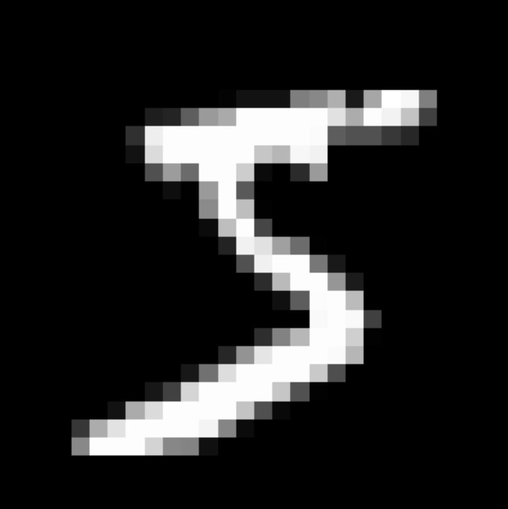
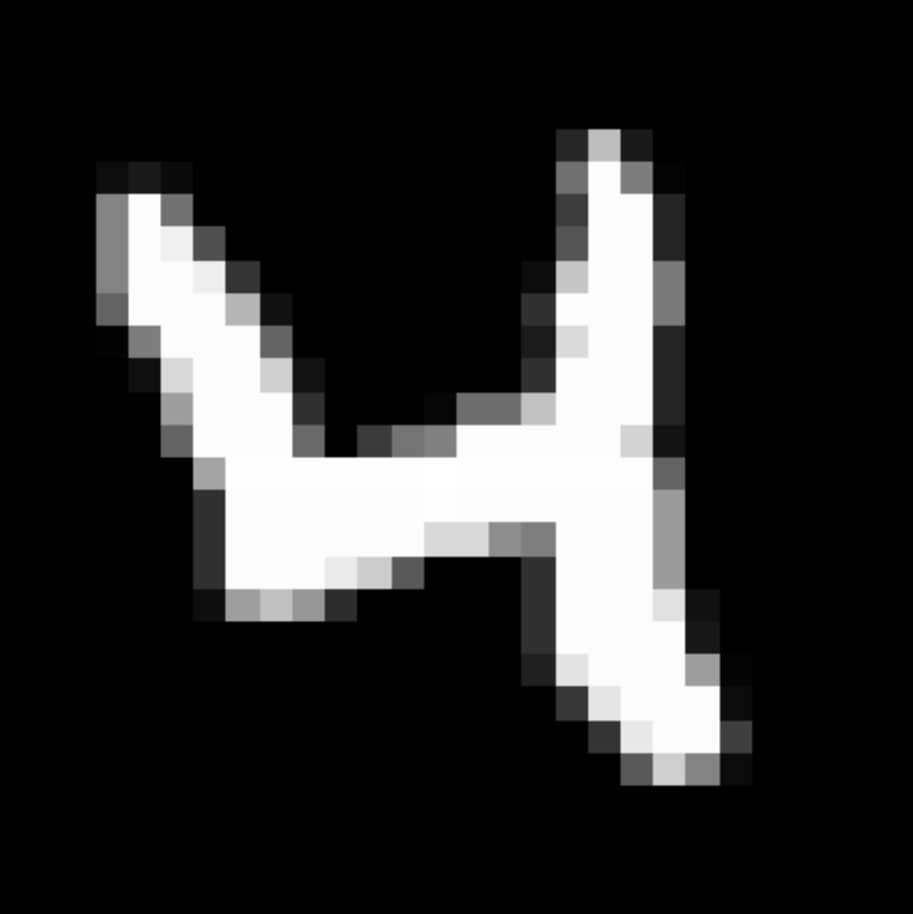
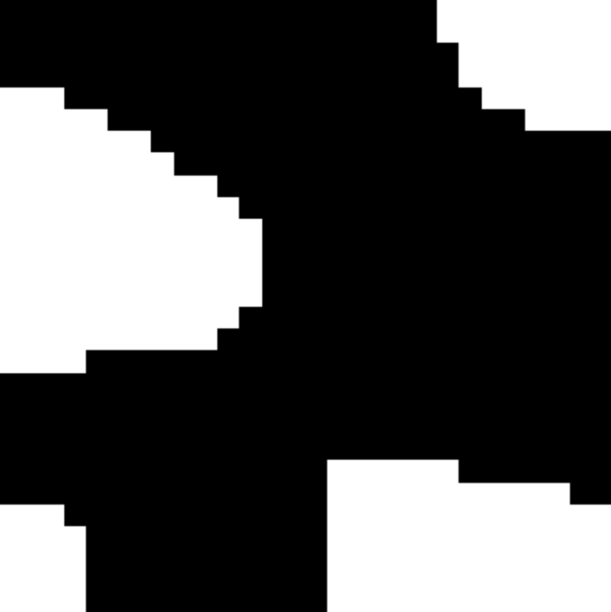
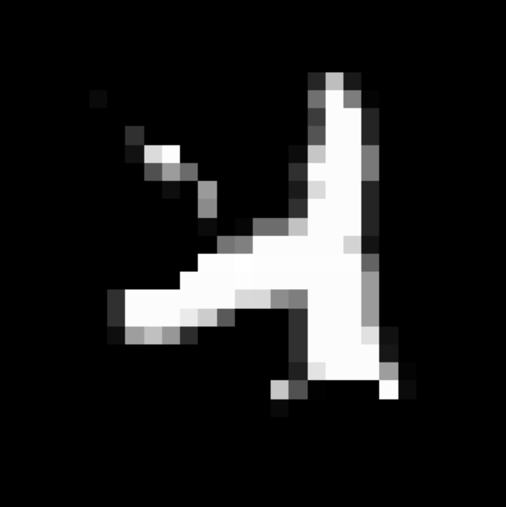

# Forward-Forward-Algorithm

 This repo is the implementation of a simple unsupervised example of FF in this paper.
>[Geoffrey Hinton. The Forward-Forward Algorithm: Some Preliminary Investigations](https://arxiv.org/pdf/2212.13345.pdf)

## Negative data
<table>
  <tbody>
    <tr>
      <td align="center">
        
      </td>
      <td align="center">
        
      </td>
      <td align="center">
        
      </td>
      <td align="center">
        
      </td>
    </tr>
    <tr>
      <td align="center">x1</td>
      <td align="center">x2</td>
      <td align="center">mask</td>
      <td align="center">x_neg</td>
    </tr>
  </tbody>
</table>

I created mask by repeatedly blurring a random bit image with a filter [1/4,1/2,1/4] in both the horizontal and vertical as the paper explained. Then generated negative data by x1 * mask + x2 * (1-mask) with random x1, x2 in original mnist data.

## Architecture
writing...

## Refernces
- [Geoffrey Hinton. The Forward-Forward Algorithm: Some Preliminary Investigations](https://arxiv.org/pdf/2212.13345.pdf)
- [mohammadpz/pytorch_forward_forward](https://github.com/mohammadpz/pytorch_forward_forward)

